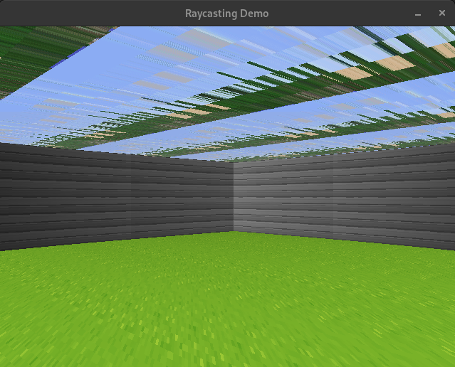

# cube3D 🧊

**cube3D** is a simple 3D graphics project inspired by early 3D games like Wolfenstein 3D. It uses raycasting to render a 3D environment and allows basic player interaction. This project is developed in C using the MinilibX library as part of the 42 School curriculum.

## Features

- **3D Rendering**: Create a pseudo-3D environment using raycasting.
- **Player Movement**: Move forward, backward, and rotate the view.
- **Textured Walls**: Load and display textures for walls.
- **Dynamic Lighting** (optional): Simulate basic lighting effects.
- **Configurable Maps**: Parse and load maps from a configuration file.

## Screenshots



## Getting Started

### Prerequisites

- **Operating System**: Unix/Linux (MacOS recommended for MinilibX compatibility)
- **Compiler**: GCC or Clang
- **Libraries**:
  - MinilibX
  - math library (usually `-lm`)

### Installation

1. Clone the repository:

   ```bash
   git clone https://github.com/yourusername/cube3D.git
   cd cube3D
   ```

2. Build the project:

   ```bash
   make
   ```

3. Run the program:

   ```bash
   ./cube3D maps/example.cub
   ```

### Concepts

                  player->dir
                      │
                      ▼
    ◄───────────────────────────────►
    |                |                |
    Left             Center            Right
    (ray_angle =     (ray_angle =      (ray_angle =            
    player->dir -    player->dir)       player->dir+
    fov_rad/2)                         fov_rad/2)

### Controls

| Key           | Action                |
|---------------|-----------------------|
| `W`/`Up`      | Move forward          |
| `S`/`Down`    | Move backward         |
| `A`/`Left`    | Strafe left           |
| `D`/`Right`   | Strafe right          |
| `Left Arrow`  | Rotate view left      |
| `Right Arrow` | Rotate view right     |
| `ESC`         | Exit the program      |

## Configuration Files

Maps are defined in `.cub` files. Example structure:

```
NO ./textures/north_texture.xpm
SO ./textures/south_texture.xpm
WE ./textures/west_texture.xpm
EA ./textures/east_texture.xpm
F 220,100,0
C 225,30,0

111111
100001
101001
100001
111111
```

- `NO`, `SO`, `WE`, `EA`: Texture paths for each wall.
- `F`: Floor color in RGB format.
- `C`: Ceiling color in RGB format.
- Map layout: A grid of `1` (wall) and `0` (empty space).

## Project Structure

```
cube3D/
├── src/
│   ├── main.c            # Entry point
│   ├── raycasting.c      # Raycasting implementation
│   ├── input.c           # Handle player input
│   ├── rendering.c       # Rendering logic
│   └── utils.c           # Utility functions
├── assets/
│   ├── textures/         # Default textures
│   └── screenshot.png    # Example screenshot
├── maps/
│   └── example.cub       # Sample map
├── includes/
│   └── cube3D.h          # Header file
├── Makefile
└── README.md
```

## To-Do List

- [ x] Parse maps
- [ x] display the map in 2d
- [ x] Basic 3D rendering with raycasting
- [ x] Textured walls
- [ x] Dynamic lighting
- [ ] Interactive elements (maybe) (e.g., doors, pickups)

## License

This project is licensed under the MIT License. See the [LICENSE](./LICENSE) file for details.

## Acknowledgments

- [42 School](https://www.42.fr/) for providing the inspiration and guidance.
- [Wolfenstein 3D](https://en.wikipedia.org/wiki/Wolfenstein_3D) for the original raycasting concept.
  
## Made with :sparkling_heart: by:

<ul>
  <li><a href="https://github.com/ayoubelmohamedi" style="font-size: 24px;">Ayoub Elmohamedi</a></li>
  <li><a href="https://github.com/ahmedez-zouine" style="font-size: 24px;">AHMED EZ-ZOUINE (his last name is handsome)</a></li>
</ul>

